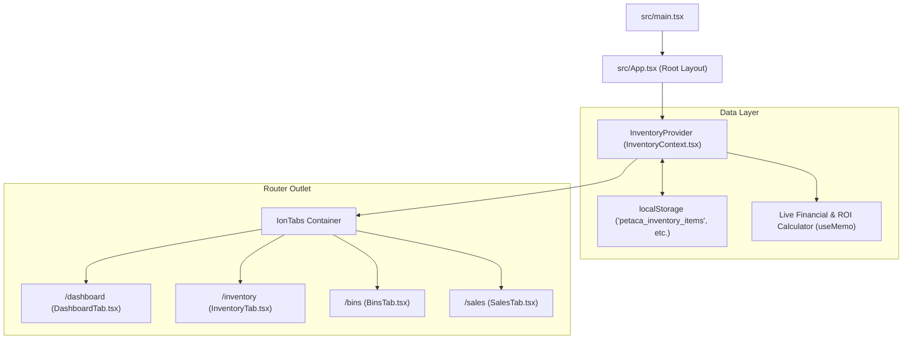
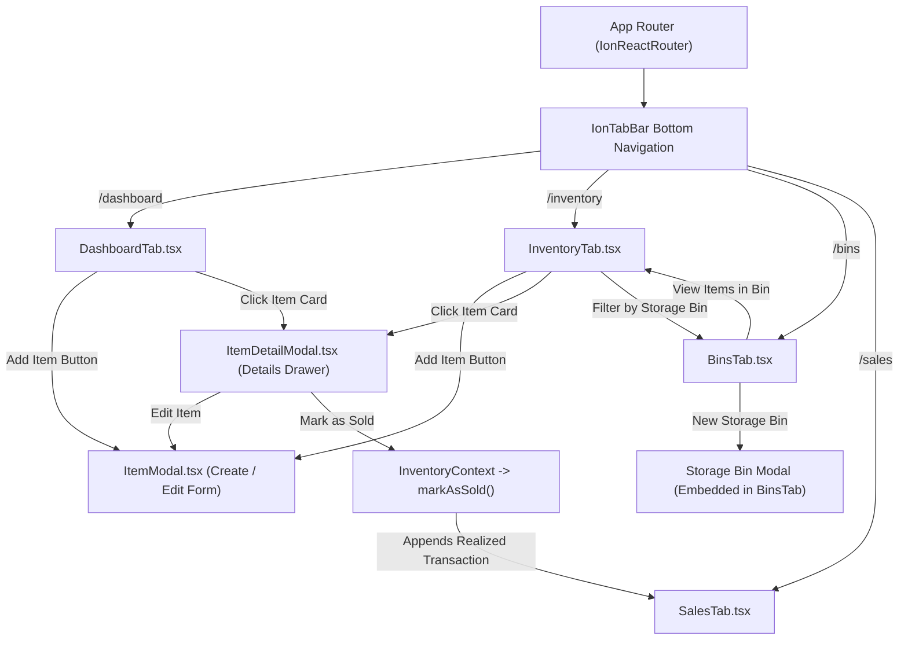

# 📦 Petaca - Application Architecture & Page Connection Map

> **Document Purpose**: Technical architecture guide, page routing map, and editable file catalog for the **Petaca** store inventory management system.

---

## 1. Executive Summary & Tech Stack

**Petaca** is built as a high-performance web application utilizing modern frontend tooling:

* **Core Framework**: React 18 + TypeScript + Vite
* **UI Component Library**: `@ionic/react` (v8) + Ionicons
* **Navigation & Routing**: `@ionic/react-router` (`IonReactRouter`, `IonTabs`, `IonTabBar`)
* **State Management**: React Context (`InventoryContext`) with automatic `localStorage` persistence
* **Styling System**: CSS custom properties / variables + Vanilla CSS utility layers

---

## 2. Architecture & Data Flow Overview

---

## 3. Interactive Page & Navigation Connection Map

---

## 4. Component & Navigation Connections

| Page / Component | Route / Location | Primary Role & Connections |
| :--- | :--- | :--- |
| [App.tsx](file:///c:/Users/im_sa_sy8qn1m/dev_workspace/petaca/src/App.tsx) | Root Component | Defines main application shell, tabs bar, and route paths. |
| [DashboardTab.tsx](file:///c:/Users/im_sa_sy8qn1m/dev_workspace/petaca/src/pages/DashboardTab.tsx) | `/dashboard` | Executive store dashboard displaying total active inventory value, net profit projections, and recent activity. Opens `ItemModal` and `ItemDetailModal`. |
| [InventoryTab.tsx](file:///c:/Users/im_sa_sy8qn1m/dev_workspace/petaca/src/pages/InventoryTab.tsx) | `/inventory` | Catalog view with search toolbar, status segment filters (All / Active / Draft / Sold), category filters, storage bin filters, and Grid/List view toggle. |
| [BinsTab.tsx](file:///c:/Users/im_sa_sy8qn1m/dev_workspace/petaca/src/pages/BinsTab.tsx) | `/bins` | Storage bin organizer tracking physical rack locations, item counts per bin, and total bin asset valuation. |
| [SalesTab.tsx](file:///c:/Users/im_sa_sy8qn1m/dev_workspace/petaca/src/pages/SalesTab.tsx) | `/sales` | Completed sales ledger calculating gross sales revenue, eBay fees (13.25% + $0.30 fixed), shipping label expenses, and net profit realized per sale. |
| [ItemModal.tsx](file:///c:/Users/im_sa_sy8qn1m/dev_workspace/petaca/src/components/ItemModal.tsx) | Modal Component | Form modal for creating or updating inventory items with real-time fee & ROI margin previews. |
| [ItemDetailModal.tsx](file:///c:/Users/im_sa_sy8qn1m/dev_workspace/petaca/src/components/ItemDetailModal.tsx) | Modal Component | Comprehensive item details popup featuring profit breakdown, eBay link, bin info, edit trigger, deletion confirmation, and "Mark as Sold" workflow. |

---

## 5. Editable File Catalog (Categorized by Purpose)

### ⚙️ Core Application & Routing
- [App.tsx](file:///c:/Users/im_sa_sy8qn1m/dev_workspace/petaca/src/App.tsx) – Modify tab bar layout, icon links, and route definitions.
- [main.tsx](file:///c:/Users/im_sa_sy8qn1m/dev_workspace/petaca/src/main.tsx) – Application mounting point.
- [index.html](file:///c:/Users/im_sa_sy8qn1m/dev_workspace/petaca/index.html) – HTML template, viewport configuration, and fonts.

### 🧠 State Management, Data Models & Initial Data
- [InventoryContext.tsx](file:///c:/Users/im_sa_sy8qn1m/dev_workspace/petaca/src/context/InventoryContext.tsx) – Edit state logic, `localStorage` persistence, fee calculation formulas, and CRUD functions (`addItem`, `updateItem`, `deleteItem`, `markAsSold`, `addBin`).
- [inventory.ts](file:///c:/Users/im_sa_sy8qn1m/dev_workspace/petaca/src/types/inventory.ts) – TypeScript interfaces for `InventoryItem`, `SaleRecord`, `StorageBin`, `InventoryStats`, `ItemCategory`, and `ListingStatus`.
- [initialData.ts](file:///c:/Users/im_sa_sy8qn1m/dev_workspace/petaca/src/data/initialData.ts) – Fallback seed data loaded when local storage is empty.

### 🖥️ Pages & Views
- [DashboardTab.tsx](file:///c:/Users/im_sa_sy8qn1m/dev_workspace/petaca/src/pages/DashboardTab.tsx) – Customize dashboard metrics, top active inventory widgets, and store banner.
- [InventoryTab.tsx](file:///c:/Users/im_sa_sy8qn1m/dev_workspace/petaca/src/pages/InventoryTab.tsx) – Customize search, filter bars, view toggle (grid vs. list), or catalog cards.
- [BinsTab.tsx](file:///c:/Users/im_sa_sy8qn1m/dev_workspace/petaca/src/pages/BinsTab.tsx) – Customize storage bin organizer, rack cards, and bin metrics.
- [SalesTab.tsx](file:///c:/Users/im_sa_sy8qn1m/dev_workspace/petaca/src/pages/SalesTab.tsx) – Customize sales log table, profit metrics, and fee breakdowns.

### 🧩 UI Components & Modals
- [ItemModal.tsx](file:///c:/Users/im_sa_sy8qn1m/dev_workspace/petaca/src/components/ItemModal.tsx) – Customize item creation/edit form fields and live profit preview logic.
- [ItemDetailModal.tsx](file:///c:/Users/im_sa_sy8qn1m/dev_workspace/petaca/src/components/ItemDetailModal.tsx) – Customize item detail drawer, "Mark as Sold" prompt, and action buttons.

### 🎨 Design System & Theme Styling
- [variables.css](file:///c:/Users/im_sa_sy8qn1m/dev_workspace/petaca/src/theme/variables.css) – CSS custom properties for dark/light themes, color tokens, and font families.
- [custom.css](file:///c:/Users/im_sa_sy8qn1m/dev_workspace/petaca/src/theme/custom.css) – Layout grids, custom card glassmorphism, badges, and micro-animations.
